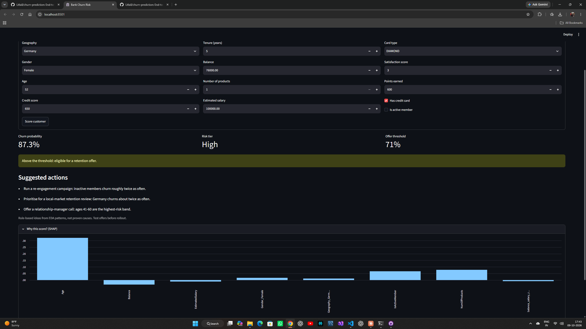
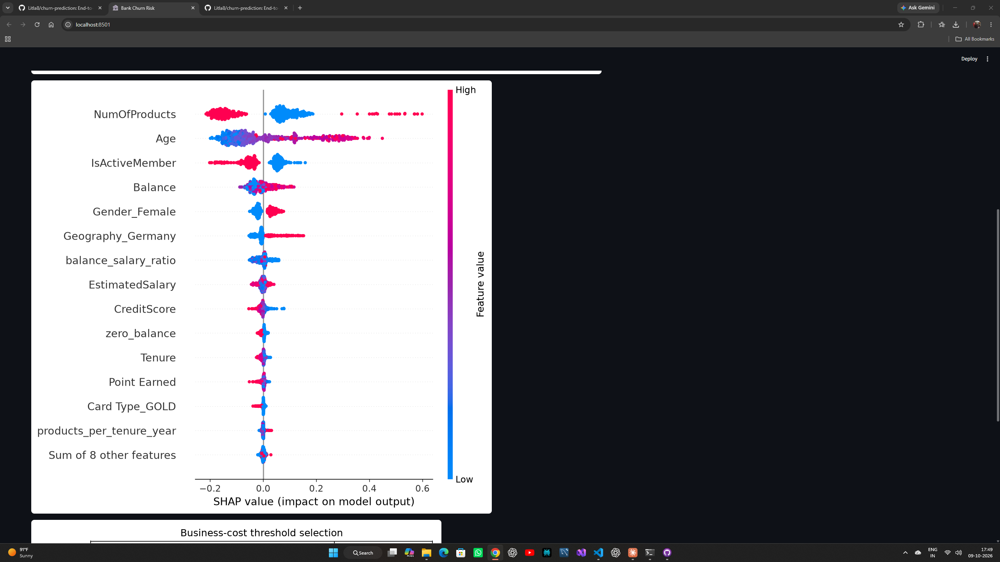
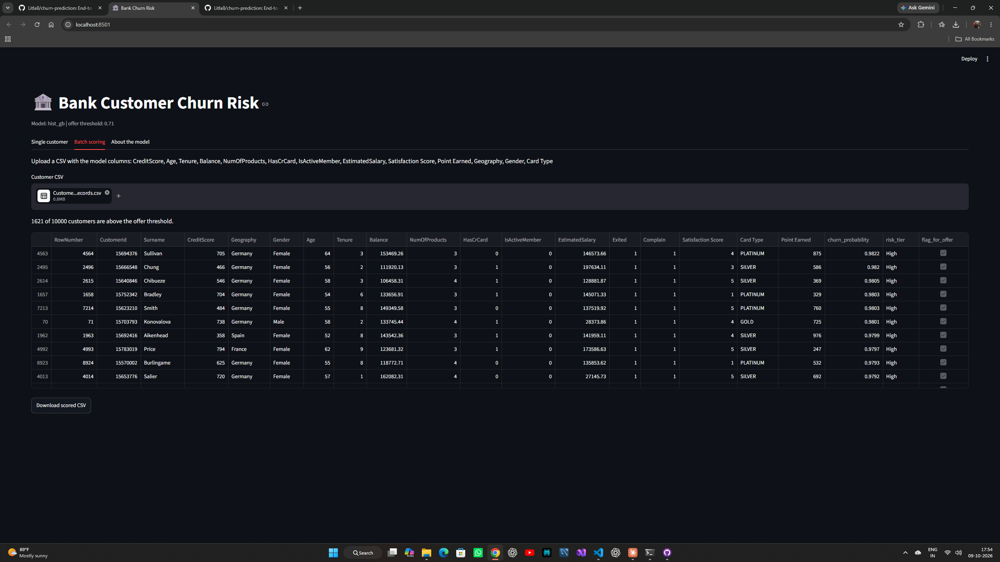

# Bank Customer Churn Prediction

[](https://github.com/Litla8/churn-prediction/actions/workflows/tests.yml)

An end-to-end machine learning project that predicts which bank customers are likely to leave, explains
why, and turns the prediction into an action through a business-cost decision threshold. It ships as a
tested Python package, a Streamlit dashboard and a FastAPI/Docker scoring service.



## The problem

Winning a new customer costs several times more than keeping an existing one. About 20% of the 10,000
customers in this dataset left. The goal is to flag the customers who are most likely to leave early
enough for the bank to make a retention offer, without wasting offers on customers who would have
stayed anyway.

**Data:** [Bank Customer Churn](https://www.kaggle.com/) records (`Customer-Churn-Records.csv`, 10,000
rows, 18 columns). Download it and place it at `data/raw/Customer-Churn-Records.csv`.

### Key data finding: `Complain` is target leakage
`Complain` has a 0.996 correlation with the target and 99.8% of customers who left have a complaint
recorded. It is almost certainly captured after the decision to leave, so it is **excluded** from the
model. Including it produces a near-perfect ROC-AUC that would be useless in practice
(reproduce with `python -m churn.pipeline --include-complain`).

## Approach

1. **Validate and clean:** schema, dtype, binary-target and range checks; duplicates removed on
   `CustomerId`; IDs and leakage columns dropped.
2. **Split:** stratified 70/15/15 train/validation/test with `random_state=42`. The test set is used
   once, at the end.
3. **Features:** balance-to-salary ratio, products per tenure year, zero-balance flag; imputation,
   scaling and one-hot encoding live inside the sklearn `Pipeline`, so nothing leaks between folds.
4. **Models:** logistic regression (baseline), random forest, HistGradientBoosting, XGBoost and
   LightGBM, compared with 5-fold stratified cross-validation. Class imbalance is handled with class
   weights, not resampling.
5. **Threshold:** chosen on the validation set to maximise expected net benefit of a retention
   campaign (offer cost vs. the value of a saved customer), not left at 0.5.
6. **Explainability:** model-agnostic SHAP (permutation explainer) on held-out test rows.

## Results

| Model | CV ROC-AUC |
|---|---|
| **HistGradientBoosting (selected)** | **0.865** |
| Random forest | 0.859 |
| XGBoost | 0.856 |
| LightGBM | 0.856 |
| Logistic regression | 0.766 |

On the held-out test set the selected model reaches **ROC-AUC 0.873** and PR-AUC 0.72. At the
cost-optimal threshold of 0.71 it has **precision 0.69 and recall 0.59**.

Recall is below a typical 0.75 target on purpose: the threshold maximises expected net benefit under
placeholder costs (offer 100, 30% save rate, customer worth 1,000; set your own in `config.yaml`). The
net-benefit curve is flat between thresholds of roughly 0.5 and 0.8, so a retention team can raise recall
at little cost by lowering the threshold.


## What drives churn

Full plain-English write-up: [`docs/churn_drivers_plain_english.md`](docs/churn_drivers_plain_english.md).

1. **Number of products:** two products is the sweet spot (7.6% churn); one product 27.7%; three or
   four products leave far more often (small group).
2. **Age:** risk rises sharply after 40 (34% at 41-50, 56% at 51-60) and falls again after 60.
3. **Inactivity:** inactive members churn at 26.9% vs 14.3% for active members.
4. **Account balance:** customers holding a balance leave more often (24.1% vs 13.8% at zero balance).
5. **Gender:** women leave more often (25.1% vs 16.5%). Dropping gender costs about 0.001 ROC-AUC, so
   it should be removed before any production use for fairness reasons.

Germany (32.4% churn vs about 16% elsewhere) ranks just outside the top five.



## How to run

Requires Python 3.12 (3.10+ should work). Windows PowerShell shown; use `source .venv/bin/activate` on macOS/Linux.

```powershell
python -m venv .venv
.venv\Scripts\Activate.ps1
pip install -r requirements.txt

python -m churn.eda                  # EDA figures and eda_summary.json in reports/
python -m churn.pipeline             # train, pick threshold, save model + metrics + plots
python -m churn.explain              # SHAP plots and plain-English drivers
pytest                               # run the tests
streamlit run app/streamlit_app.py   # dashboard at http://localhost:8501
```

Useful flags: `--config config.yaml`, `--data-path`, `--log-level DEBUG`, `--include-complain`.

### Dashboard
Single-customer scoring with a risk tier, rule-based retention suggestions and a per-customer SHAP chart,
plus batch scoring of an uploaded CSV with a download button.


*Batch scoring of the full dataset, which includes rows the model trained on, so the flagged count is
illustrative and not a performance claim.*

### API
```powershell
uvicorn churn.api:create_app --factory --port 8000    # interactive docs at http://localhost:8000/docs
```
```powershell
$body = @{ geography="Germany"; gender="Female"; age=52; credit_score=650; tenure=5; balance=76000;
           num_of_products=1; has_cr_card=1; is_active_member=0; estimated_salary=100000;
           card_type="DIAMOND"; satisfaction_score=3; point_earned=600 } | ConvertTo-Json
Invoke-RestMethod -Uri http://localhost:8000/predict -Method Post -Body $body -ContentType "application/json"
```
Endpoints: `GET /health`, `POST /predict`, `POST /predict/batch` (up to 1,000 customers). Responses contain
`churn_probability`, `risk_tier`, `flag_for_offer`, `threshold` and `suggested_actions`. Invalid input
returns HTTP 422.

### Docker
```powershell
docker build -t churn-api .
docker run --rm -p 8000:8000 churn-api
```
The image bundles the trained model, so run `python -m churn.pipeline` first. The scikit-learn version in
the image must match the one used for training (pin it in `requirements-api.txt`); `/health` reports both
versions.

## Project structure

```
churn/        config.py data.py features.py models.py train.py evaluate.py pipeline.py
              eda.py explain.py scoring.py api.py
app/          streamlit_app.py
tests/        pytest suite (synthetic fixtures, mocked data loading)
docs/         plain-English drivers, screenshots
config.yaml   optional overrides (paths, CV folds, business costs, hyperparameters)
Dockerfile    scoring API image
```

## Limitations and honest notes

- **Business costs are placeholders.** The chosen threshold depends on them; replace with real figures.
- **Associations, not causes.** SHAP and segment rates describe patterns; validate any retention offer
  with an A/B test.
- **Single snapshot, random split.** The dataset has no dates, so there is no time-based validation and
  no drift check. In production, monitor score distributions and retrain periodically.
- **Probabilities are not calibrated.** Class weights inflate them, which is one reason the best
  threshold (0.71) is higher than the textbook break-even point.
- **Gender is a model input** in this version; see the fairness note above.

## Next steps

Probability calibration, hyperparameter tuning with Optuna, a drift-monitoring job and an A/B test plan
for the retention offers.
